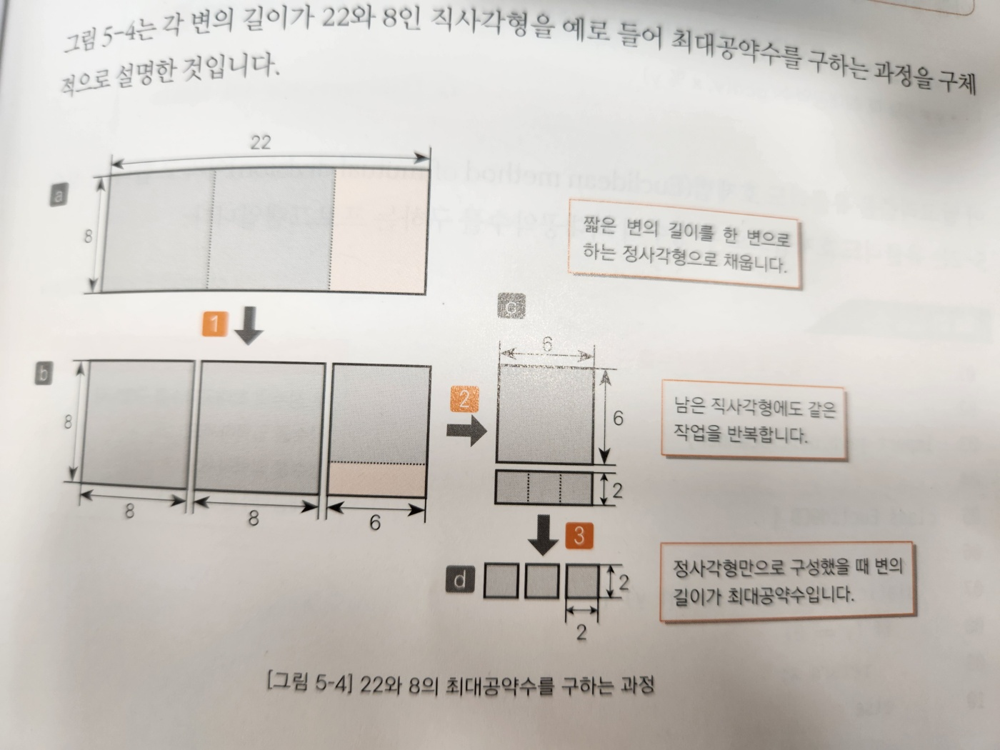

## 최대공약수
최대공약수는 두 수의 공통된 약수 중 가장 큰 약수를 지칭한다.

## 유클리드 호제법
두 수의 최대공약수를 구하는 방법 중 유클리드 호제법을 알아보자.

두 수를 A, B라고 했을 때 이 문제는 다음 문제로 바꿀 수 있다.
> 두 변이 A, B인 직사각형을 가득 채울 수 있는 정사각형 중 크기가 가장 큰 정사각형의 한 변의 길이를 구하라

각 변이 22, 8인 직사각형을 예로 들자면 우선 다음 그림과 같이 나타낼 수 있다.

이를 말로 설명하면,
1. 두 변 중 길이가 짧은 변을 한 변으로 하는 정사각형으로 직사각형을 채운다.
2. 남는 영역이 존재하면 해당 영역에도 1번 과정을 적용한다.
3. 모두 정사각형으로 채워질 때까지 위 과정을 반복하고 마지막으로 채운 정사각형의 한 변의 길이를 구한다.

이를 수학적으로 나타내기 위해 두 수 x, y의 최대 공약수를 gcd(x, y)라고 해보자.
x = az, y = bz라고 할 때 z = gcd(x, y)이다. 이를 정리하면 다음과 같다.
> y = 0일 때 최대공약수는 x 
> y != 0일 때 최대공약수는 gc(y, x % y)

이 알고리즘을 유클리드 호제법이라고 하며 반복문이나 재귀 함수로 구현할 수 있다.