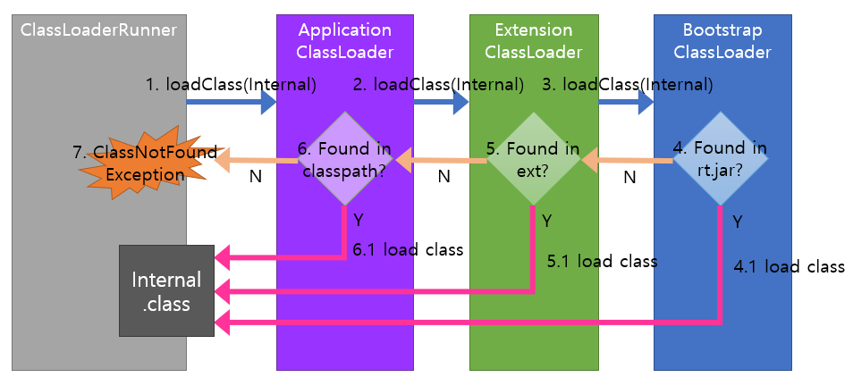

# Class Loader
## Class Loader란
클래스 로더는 `.class` 파일(바이트 코드)를 읽고 JVM이 사용할 수 있도록 
메모리 영역(Runtime Data Area)의 메소드 영역(Method Area)에 적재하는 역할을 한다.
모든 클래스를 한번에 로드하지 않고, 필요할 때 로드한다.

클래스를 로드하는 과정은 로딩, 링킹, 초기화 세 단계로 이루어진다.

1. 로딩
    - 다음 세 가지 Class Loader가 로딩 단계에 참여한다. 
    Class Loader 이름(class 이름)
    [Bootstrap Class Loader (BootClassLoader)](#Bootstrap-Class-Loader),
      [Extension Class Loader (PlatformClassLoader)](#Extension-Class-Loader),
      [Application Class Loader (AppClassLoader)](#Application-Class-Loader)
    - `.class` 파일(바이트 코드)을 Runtime Data Area의 Method Area에 저장한다.
    - 저장되는 정보는 다음과 같다.
        - 해당 클래스 및 부모 클래스 정보
        - 변수, 메서드 정보
2. 링킹
    - 바이트 코드가 자바 언어의 명세와 JVM의 명세를 잘 따르는지 확인한다.
        - 블로그의 글을 참조하고 나름대로 각색하여 글을 작성하고 있지만 여기서 말하는 JVM의 명세가 무엇을 말하는지
        잘 모르겠다. 그래서 일단 그대로 작성하였다.
    - 클래스가 필요로 하는 메모리 영역을 할당하고 클래스의 메서드, 필드를 나타내는 데이터 구조를 준비한다.
    - 심볼릭 레퍼런스를 Method 영역에 있는 실제 레퍼런스로 교체한다.
3. 초기화
    - 클래스 변수들을 초기값으로 설정한다. 즉, static 변수를 초기화한다.

이제 각 단계별로 어떤 과정이 진행되는지 알아보자.
## 1-1. 로딩 - Class Loader
JVM의 Class Loader는 BootStrap / Extension / Application Class Loader 세 가지로 나뉜다. 
Class Loader들은 JAVA 소스코드로 정의되어 있다. 일부 메서드는 native 키워드가 붙어있다.  
native 키워드는 메서드에만 사용할 수 있으며 해당 메서드는 JNI(Java Native Interface 또는 [Native Method Interface](./Native-Method-Interface.md)) 를 사용해서 구현되었음을 뜻한다.
JNI 인터페이스는 C / C++로 구현되어 있다.  
각 Class Loader는 Runtime Data Area의 Method Area에 클래스를 로드한다는 동일한 역할을 수행하지만 로드하는 클래스의 종류가 다르다.
세 Class Loader 모두 `BuiltinClassLoader`라는 클래스를 상속 받는다.
JAVA 21 버전 기준으로 `ClassLoaders`라는 클래스 내부에 `static class`로 선언되어 있다.

클래스 로더 이름(소스코드 상의 class 이름)

### Bootstrap Class Loader
Bootstrap Class Loader는 최상위 Class Loader이다. JAVA 8 버전 이전에는 jre, lib, rt.jar에 담긴 JDK 클래스 파일을 로드한다.
하지만 JAVA 9 버전 이후부터 JAVA의 파일 구조가 변경되며 Class Loader와 최소한의 자바 클래스(java.lang.Object, Class, ClassLoader)만 로드한다.

### Extension Class Loader
Extension Class Loader는 Bootstrap Class Loader가 로드하지 않은 확장 클래스들을 로드한다.

### Application Class Loader
Application Class Loader는 개발자가 작성한 클래스를 로드한다.

## 1-2. 로딩 - Class Loader의 작동 원칙 세 가지

JAVA의 Class Loader는 Delegation Principle(위임 원칙), Visibility Principle(가시 범위 원칙), 
Uniqueness Principle(유일성 원칙) 세 가지 작동 원칙을 가진다.

### Delegation Principle
**위임 원칙**은 로딩할 클래스를 찾을 때에는 위에서 설명한 세 가지 Class Loader의 하위 계층에서 상위 계층으로 로딩을 위임하는 원칙이다.
아래 그림을 참고하면서 설명을 보면 이해가 쉬울 것이다.  

`Internal.class`라는 클래스 파일이 로드 되어야 하는 상황을 가정하면 다음과 같은 과정이 일어난다.(아래 과정의 번호는 위 사진의 번호와 무관하다)
1. 그러면 우선 Application Class Loader가 이 요청을 받아들이고 상위 Class Loader인 Extension Class Loader에게 이 요청을 위임한다. 
2. 요청을 받은 Extension Class Loader는 상위 계층인 Bootstrap Class Loader에게 요청을 위임한다. 
3. 최상위 Class Loader인 Bootstrap Class Loader는 요청을 받아들이고 자신이 담당하는 클래스 중 `Internal.class가` 존재하는지 확인한다.
4. 만약 존재한다면 반환한다.(끝)
5. 3번 결과가 존재하지 않는다면 하위 Class Loader인 Extension Class Loader에 요청을 전달한다.
6. Extension Class Loader는 자신이 담당하는 클래스들 중 `Internal.class가` 존재하는지 확인한다.
7. 만약 존재한다면 반환한다.(끝)
8. 6번 결과가 존재하지 않는다면 하위 Class Loader인 Application Class Loader에 요청을 전달한다.
9. 마찬가지로 Application Class Loader도 `Internal.class` 클래스가 존재하는지 확인한다.
10. 만약 존재한다면 반환한다.(끝)
11. 9번 결과가 존재하지 않는다면 `ClassNotFoundException` 예외를 던진다.

### Visibility Principle
**가시 범위 원칙**은 하위 클래스 로더는 상위 클래스 로더가 로딩한 클래스를 볼 수 있고, 
반대로 상위 클래스 로더는 하위 클래스 로더가 로딩한 클래스를 볼 수 없다는 원칙이다. 
이 원칙을 둔 이유는 하위 클래스와 상위 클래스를 명확하게 구분하기 위해서이다.
이 원칙을 지킨다면 하위 클래스(예를 들어 개발자가 직접 생성한 클래스)를 로드할 때 상위 클래스(예를 들어 `Object`)를
볼 수 있기 때문에 정상적으로 로드할 수 있다. 만약 상위 클래스가 하위 클래스를 볼 수 있다면 상위 클래스와 하위 클래스를
구분한 의미가 퇴색될 것이다.

### Uniqueness Principle
**유일성 원칙**은 하위 클래스 로더는 상위 클래스 로더가 로딩한 클래스를 다시 로딩하지 않도록 함으로써
로딩된 클래스들이 유일하도록 보장하는 원칙이다. 유일성을 식별하는 기준은 클래스의 binary name이다.
binary name은 `toString()`을 호출할 때 가끔 보이는 `java.lang.String` 등과 같은 이름이다.

위임 원칙을 준수하면 상위 클래스 로더로 로딩 요청을 위임하기 때문에 유일성 원칙을 보장할 수 있다.

## 2. 링킹 - 심볼릭 레퍼런스(Symbolic Reference)
링킹 과정에서는 **검증**(.class 파일 형식이 유효한지 검사), **준비**(메모리 할당 및 필드, 메서드, 인터페이스를 나타내는 데이터 구조 준비),
**분석**(심볼릭 레퍼런스를 실제 레퍼런스로 교체, Optional) 과정을 수행한다. 그 중 분석 단계에서 사용된 용어인 '심볼릭 레퍼런스'란 무엇일까?

심볼릭 레퍼런스는 우리가 개발을 하면서 사용한 class, field, method의 이름을 지칭한다. 
실제 메모리를 참조하지 않고 추상적이라고 할 수 있는 단어나 기호를 가리킨다. 
링킹 단계에서는 이러한 심볼릭 레퍼런스를 실제 레퍼런스, 즉 실제 메모리 주소로 변환하는 과정을 거친다.

# 참조
[blog](https://steady-coding.tistory.com/593) 
[blog](https://beststar-1.tistory.com/13) 
[blog](https://homoefficio.github.io/2018/10/13/Java-%ED%81%B4%EB%9E%98%EC%8A%A4%EB%A1%9C%EB%8D%94-%ED%9B%91%EC%96%B4%EB%B3%B4%EA%B8%B0/)
