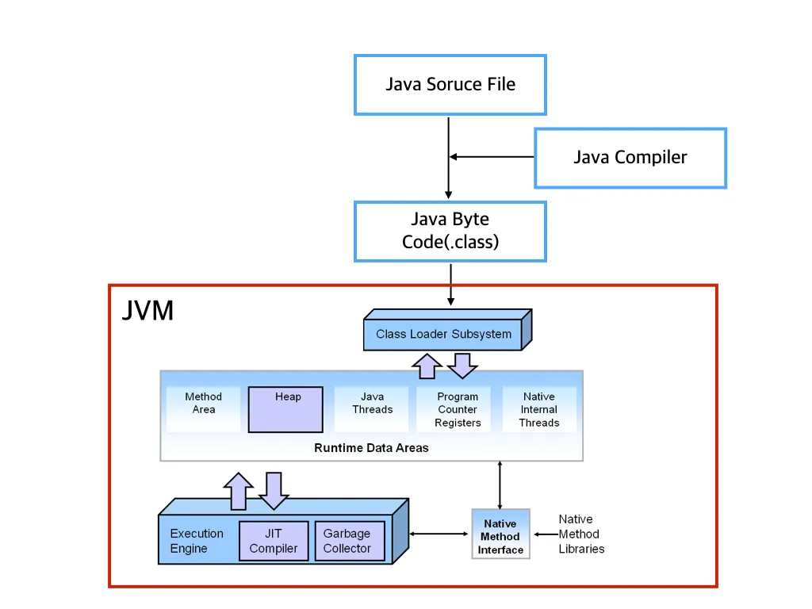

# JVM(Java Virtual Machine)이란

JVM(Java Virtual Machine)을 비유적으로 말하면 '자바 애플리케이션과 운영체제를 연결하는 다리'이다. 
JVM이 없으면 자바 애플리케이션과 운영체제를 연결하기 위해서 개발자가 코딩을 통해 직접 다리를 놓아주어야 한다. 

하지만 JVM이 이를 대신함으로써 개발자는 운영체제와 독립된 환경에서 개발을 할 수 있게 되어 개발 효율이 좋아지고,
같은 자바 애플리케이션을 다른 운영체제에서 그대로 실행할 수 있기 때문에 한번 작성된 자바 애플리케이션은 
JVM이 지원되는 운영체제라면 어디서든 실행이 가능하다. 

자바 애플리케이션이 실행되기 위해선 두 단계를 거친다.

1. javac 컴파일(`.java` -> `.class`)
2. jvm 실행(`.class` 파일들을 처리)

javac가 소스 코드를 컴파일하여 .class 파일을 생성하고 JVM은 이 `.class` 파일을 바탕으로 자바 애플리케이션을 실행한다.

컴파일을 담당하는 javac와 실행을 담당하는 JVM이 독립적으로 존재하는 이유는 컴파일 환경과 실행 환경을 분리하여 최적화, 유지보수 등을
용이하게 하기 위함이다. 또한 분리된 컴파일 환경 덕분에 JVM이 자바 뿐만 아니라 Kotlin, Scala 등 다른 언어도 지원할 수 있고,
이를 통해 개발 환경의 유연함을 가져갈 수 있다는 장점이 있다.

JVM은 아래와 같이 복잡한 구조를 가지고 있다. 앞으로 하나씩 차근차근 알아보자.

[이미지 출처](https://medium.com/@lazysoul/jvm-%EC%9D%B4%EB%9E%80-c142b01571f2)
