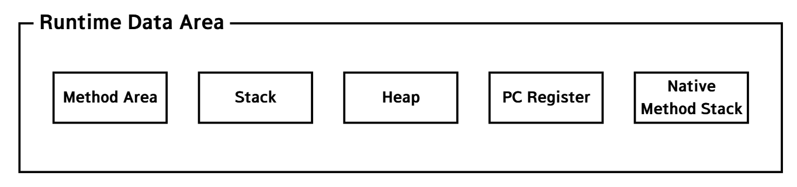
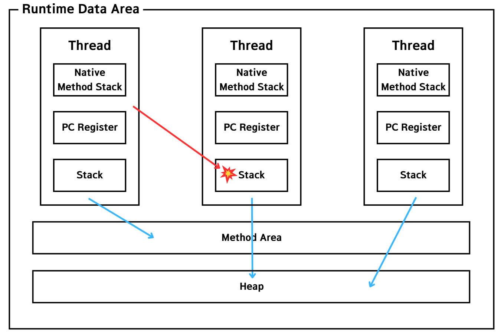
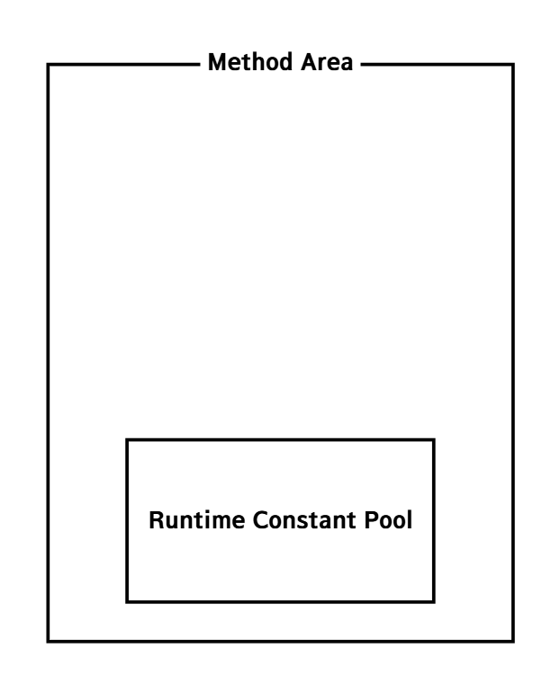
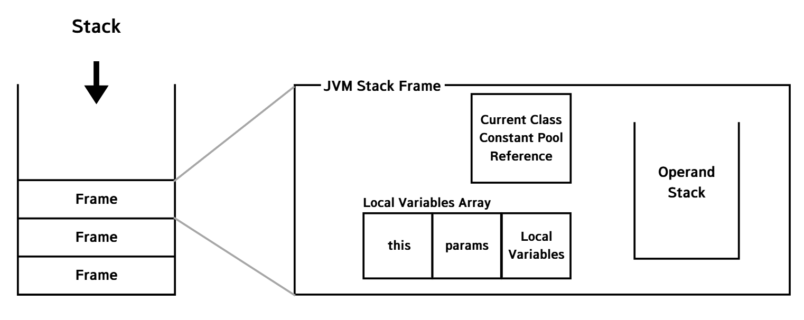

###### 본 글은 이전에 작성한 [글](../메모리-영역.md)을 참조하므로 중복된 내용이 존재할 수 있음.

# Runtime Data Area
Runtime Data Area는 Java 애플리케이션이 실행될 때 JVM이 운영체제로부터 할당받은 메모리 영역을 의미한다.

## 구성 요소
Runtime Data Area의 구성 요소는 아래와 같다.
운영체제로부터 할당 받은 메모리 영역을 JVM이 효율적으로 사용하기 위해 설계된 결과라고도 할 수 있다.

스레드와 함께 표현하면 다음과 같다. 스레드끼리는 서로의 메모리를 참조할 수 없지만 Heap, Method Area는 모든 스레드가 공유한다.

각 영역을 간단하게 정리해보자.
- Method Area - Class Loader가 로드한 클래스들의 데이터가 적재되는 메모리 영역이다. 모든 스레드가 공유한다.
- Stack - 스레드가 생성될 때마다 스레드에게 할당되는 메모리이다. 지역변수, 매개변수, 리턴값 등 일시적으로 사용되는 값이 저장된다.
- Heap - 생성된 객체가 저장되는 영역이다. 모든 스레드가 공유한다.
- PC Register - 스레드가 현재 실행 중인 주소를 저장한다.
- Native Method Stack - Native 언어로 작성된 코드를 실행하기 위한 영역이다.

### Method Area
Method Area에는 [Class Loader](./Class-Loader.md)가 로드한 클래스들에 대한 데이터를 저장한다.[(번외-클래스의 로드는 언제 필요할까?)](https://github.com/likerhythm/TIL/blob/main/JAVA/JVM/Class-Loader.md#%ED%95%84%EC%9A%94%ED%95%A0-%EB%95%8C)
이는 애플리케이션이 실행될 때 메모리에 올라가고, 종료될 때 해제된다.

Method Area 내부에는 Runtime Constant Pool이라는 이름이 붙은 영역이 존재한다. 이는 클래스에 하나씩 존재한다. 
이 영역에는 런타임 시 필요한 참조 정보를 저장한다. 
처음 클래스가 로드될 때는 클래스의 바이너리 코드에 포함된 Constant Pool에 메타 데이터(symbolic reference 등)가 저장되어 있다가
메서드나 클래스가 사용될 때 Class Loader의 링킹 단계를 거쳐서 symbolic reference가 실제 물리 레퍼런스로 변환되어 Runtime Constant Pool에 저장된다.

이 영역에 클래스 데이터가 존재하기에 인스턴스를 생성하기 위해선 이 영역을 참조해야 한다. 그래서 모든 스레드가 공유한다.
이를 반대로 말하면 시스템 전체적으로 공유되는 클래스는 Method Area에 등록하는 것이 효율적이다는 말이 된다.
대표적인 예로 Math와 같은 Util 클래스가 있다. 이러한 클래스는 모든 필드 변수와 메서드를 정적으로 선언해야 한다.

### Stack
저장되는 단위는 Frame이다.
Frame은 자바에서 `{ }`로 둘러싸인 영역을 의미한다.

### Heap

### PC Register

### Native Method Stack

# 참조
[내 벨로그 - Java - 메모리 영역](https://velog.io/@likerhythm/Java-%EB%A9%94%EB%AA%A8%EB%A6%AC-%EC%98%81%EC%97%AD)

[impala 벨로그 - [JAVA] JVM - Runtime Data Area](https://velog.io/@impala/JAVA-JVM-Runtime-Data-Area)

[dev_isaac 벨로그 - JVM은 꼭 알아야 합니다...](https://velog.io/@dev_isaac/JVM)

[기계인간 John Grib - Java 런타임 상수 풀](https://johngrib.github.io/wiki/java/run-time-constant-pool/)
