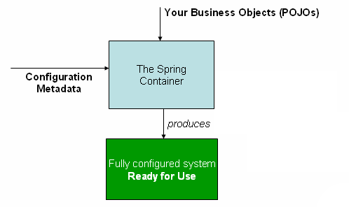

###### 본 글은 [IoC](../oop/IoC.md)에서 이어집니다.

이번 글에선 [Spring 공식 문서](https://docs.spring.io/spring-framework/reference/core/beans/basics.html)를
참고하여 Spring IoC Container가 무엇인지, 그리고 어떻게 동작하는지에 대해 대략적으로 정리해보았습니다.
IoC 공부의 연장선 정도의 글이기 때문에 깊이 있는 내용을 담지는 못한 점 참고해주시기 바랍니다.

# Spring IoC Container
Spring IoC Container는 Spring 프레임워크에서 IoC를 구현한 것입니다.

# Spring IoC Container의 기본 구성 요소
Spring IoC Container는 `BeanFactory`와 `ApplicationContext`로 나뉩니다.

> BeanFactory?

BeanFactory는 IoC 동작을 위한 기본적인 기능을 제공합니다.

> ApplicationContext?

ApplicationContext는 BeanFactory의 모든 기능을 제공하면서,
AOP, 이벤트 처리, WebApplicationContext(웹 애플리케이션에서 사용되는 계층별 Context)
등 기업 환경에 적합한 기능을 추가로제공합니다.

이 부분은 아직 정확하게 모르는 개념이 많은 것 같습니다.

# Bean?
Bean은 Spring IoC Container가 관리하는 객체입니다.
IoC Container에 의해 관리되지 않는 Bean이라면 일반 객체와 차이가 없습니다.

# Spring IoC Container의 대략적인 동작 방식

다음은 공식문서 인용문입니다.
> The container gets its instructions on the components to instantiate,
> configure, and assemble by reading configuration metadata.

Spring IoC Container가 어떤 컴포넌트를 인스턴스화하고 설정(configure), 조립(assemble)할지
결정하기 위해선 **configuration metadata**가 필요합니다.
configuration metadata는 **annotated component classes(어노테이션이 적용된 컴포넌트 클래스)**,
**configuration classes with factory method(팩토리 매서드를 사용하는 구성 클래스)**,
**XML 파일 또는 Groovy 스크립트**로 표현할 수 있습니다.

다음은 Spring IoC Container가 동작하는 대략적인 다이어그램입니다.
애플리케이션 클래스(POJOs)와 Configuration Metadata를 결합하여
ApplicationContext를 생성 및 초기화 하여 실행 가능한 시스템 또는 애플리케이션이 생성됩니다.

# Configuration Metadata
Spring IoC Container가 사용하는 Configuration Metadata는 애플리케이션의 구성 요소(컴포넌트)를 어떻게 인스턴스화하고,
설정하며, 조립할지를 알려줍니다.

Configuration Metadata를 사용하는 방법은 크게 세 가지로 나뉩니다.
자세한 내용은 공식 문서를 참고해주세요.
- [어노테이션 기반](https://docs.spring.io/spring-framework/reference/core/beans/annotation-config.html)
- [자바 기반](https://docs.spring.io/spring-framework/reference/core/beans/java.html)
- [XML 기반](https://docs.spring.io/spring-framework/reference/core/beans/basics.html#beans-factory-xml)

# 참조
https://docs.spring.io/spring-framework/reference/core/beans/basics.html
