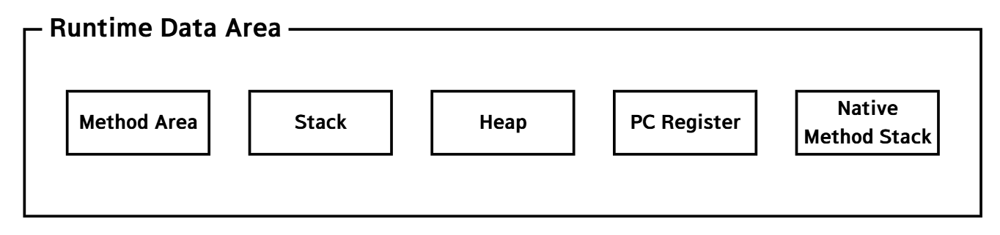
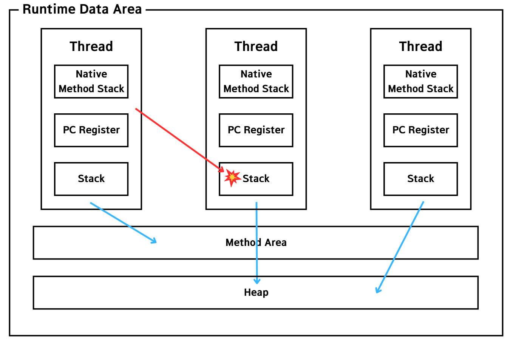
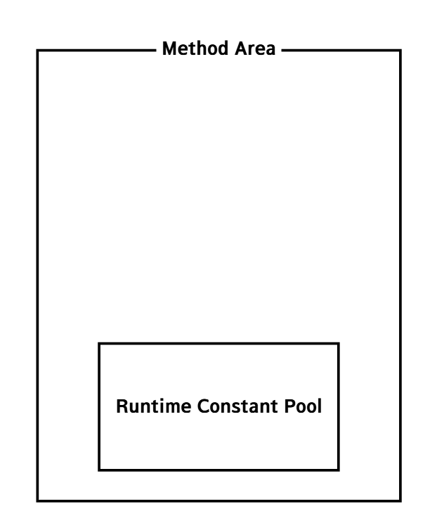
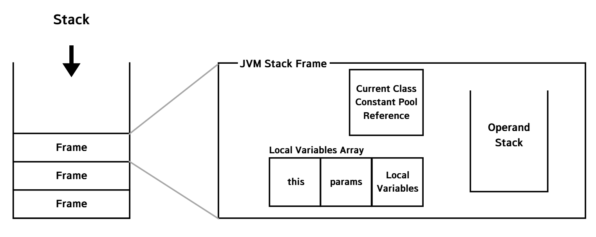
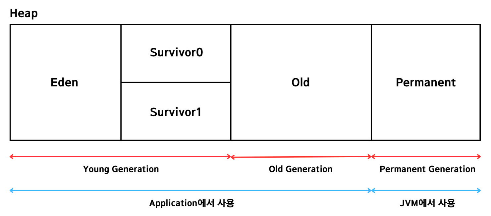

###### 본 글은 이전에 작성한 [글](../메모리-영역.md)을 참조하므로 중복된 내용이 존재할 수 있음.

# Runtime Data Area
Runtime Data Area는 Java 애플리케이션이 실행될 때 JVM이 운영체제로부터 할당받은 메모리 영역을 의미한다.

## 구성 요소
Runtime Data Area의 구성 요소는 아래와 같다.
운영체제로부터 할당 받은 메모리 영역을 JVM이 효율적으로 사용하기 위해 설계된 결과라고도 할 수 있다.

스레드와 함께 표현하면 다음과 같다. 스레드끼리는 서로의 메모리를 참조할 수 없지만 Heap, Method Area는 모든 스레드가 공유한다.

각 영역을 간단하게 정리해보자.
- Method Area - Class Loader가 로드한 클래스들의 데이터가 적재되는 메모리 영역이다. 모든 스레드가 공유한다.
- Stack - 스레드가 생성될 때마다 스레드에게 할당되는 메모리이다. 지역변수, 매개변수, 리턴값 등 일시적으로 사용되는 값이 저장된다.
- Heap - 생성된 객체가 저장되는 영역이다. 모든 스레드가 공유한다.
- PC Register - 스레드가 현재 실행 중인 주소를 저장한다.
- Native Method Stack - Native 언어로 작성된 코드를 실행하기 위한 영역이다.

## Method Area
Method Area에는 [Class Loader](./Class-Loader.md)가 로드한 클래스들에 대한 데이터를 저장한다.[(번외-클래스의 로드는 언제 필요할까?)](https://github.com/likerhythm/TIL/blob/main/JAVA/JVM/Class-Loader.md#%ED%95%84%EC%9A%94%ED%95%A0-%EB%95%8C)
클래스의 정보를 담은 Constant Pool과 클래스의 동작을 정의한 Byte Code를 포함한다.
이는 애플리케이션이 실행될 때 메모리에 올라가고, 종료될 때 해제된다.

Method Area 내부에는 Runtime Constant Pool이라는 이름이 붙은 영역이 존재한다. 이는 클래스에 하나씩 존재한다. 
이 영역에는 런타임 시 필요한 참조 정보를 저장한다. 
처음 클래스가 로드될 때는 클래스의 바이너리 코드에 포함된 Constant Pool에 메타 데이터(symbolic reference 등)가 저장되어 있다가
메서드나 클래스가 사용될 때 Class Loader의 링킹 단계를 거쳐서 symbolic reference가 실제 물리 레퍼런스로 변환되어 Runtime Constant Pool에 저장된다.

이 영역에 클래스 데이터가 존재하기에 인스턴스를 생성하기 위해선 이 영역을 참조해야 한다. 그래서 모든 스레드가 공유한다.
이를 반대로 말하면 시스템 전체적으로 공유되는 클래스는 Method Area에 등록하는 것이 효율적이다는 말이 된다.
대표적인 예로 Math와 같은 Util 클래스가 있다. 이러한 클래스는 모든 필드 변수와 메서드를 정적으로 선언해야 한다.

## Stack
Stack은 임시 데이터가 저장되는 공간이다. PC Register, Native Method Area와 함께 스레드가 생성될 때마다 할당된다.
스택의 저장 단위는 Frame이다. Frame은 자바에서 중괄호 `{}`로 둘러싸인 영역을 의미한다.
Frame 내에서 사용되는 지역변수, 매개변수, 리턴값 등이 Stack에 저장된다.

아래 사진을 통해 더 자세히 알아보자.
- Current Class Constant Pool Reference : Method Area의 Runtime Constant Pool에 대한 참조이다. Frame이 속한 클래스의 상수를 사용하기 위해 참조값을 가진다.
- Local Variables Array : Frame의 지역 변수를 담는다. this에는 현재 인스턴스에 대한 참조, params에는 매개변수, Local Variables에는 지역 변수가 저장된다.
- Operand Stack : 피연산값과 연산 과정에서 생기는 중간값을 저장한다. JVM은 하드웨어와 독립된 환경에서 동작 가능하기 위해 연산 과정에서 레지스터를 사용하지 않고, 복잡하더라도 Stack을 사용한다.
레지스터를 사용할 경우 하드웨어마다 다르게 구현해야 하기 때문이다.

만약 스레드가 사용 가능한 Stack의 사용 범위를 넘으면 `StackOverflowError`가 발생한다.
스택으 동적으로 확장할 때 또는 새로운 스레드를 만들 때 Stack에 할당할 메모리가 부족하다면 `OutOfMemoryError`가 발생한다.

## Heap
Heap에는 런타임 중에 동적으로 생성된 인스턴스가 저장된다. Heap에는 실제 인스턴스 정보가 저장되며, Stack에는 인스턴스에 접근하기 위한 참조값이 저장된다.
만약 Heap 영역이 가득 차게 되면 OutOfMemoryError가 발생한다.

Heap은 GC(Garbage Collection)의 대상이 된다. JVM은 효율적인 GC를 위해 heap을 아래와 같은 구조로 나누었다.
- Young Generation : new 키워드로 새롭게 생성된 인스턴스가 저장되고 이후에 survivor로 이동한다.
시간이 지나면서 이 영역에 있던 인스턴스가 Tenured Generation 영역으로 이동하거나 GC에 의해 회수된다.(Minor GC)
- Tenured Generation : Young Generation에 저장되어 있던 오래된 인스턴스들이 이 영역에 저장된다.
영역이 가득 차게되면 GC를 수행한다(Major GC). Major GC가 발생하면 GC를 수행하는 스레드를 제외한 모든 스레드의 작업을 중지한다.

GC에 대한 자세한 내용은 [이 글](./Garbage-Collection.md)에서 다룬다.

## PC Register
PC Register는 스레드가 현재 실행 중인 JVM 명령어를 가리킨다.
JVM은 Stack을 기반으로 동작하기 때문에 Stack에서 꺼낸 Operand를 PC Register에 저장한다(운영체제의 PC Register와 비슷한 역할을 가진 것 같다).
스레드가 생성되면 PC Register를 위한 공간도 함께 생성되고, 스레드가 소멸하면 같이 소멸한다.
만약 스레드가 Native 코드를 수행 중이라면 PC Register는 Undefined 값을 가지고 이에 대한 처리는 Native Method Stack에서 담당한다. 

## Native Method Stack
JVM에서 Native 언어(C/C++, 어셈블리)로 작성된 코드를 실행하기 위한 메모리 공간이다.
java 메서드가 아닌 Native 메서를 실행하면 이곳에 해당 메서드에 대한 정보가 저장된다.

# 참조
[내 벨로그 - Java - 메모리 영역](https://velog.io/@likerhythm/Java-%EB%A9%94%EB%AA%A8%EB%A6%AC-%EC%98%81%EC%97%AD)

[impala 벨로그 - [java] JVM - Runtime Data Area](https://velog.io/@impala/JAVA-JVM-Runtime-Data-Area)

[dev_isaac 벨로그 - JVM은 꼭 알아야 합니다...](https://velog.io/@dev_isaac/JVM)

[기계인간 John Grib - Java 런타임 상수 풀](https://johngrib.github.io/wiki/java/run-time-constant-pool/)
