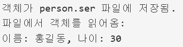
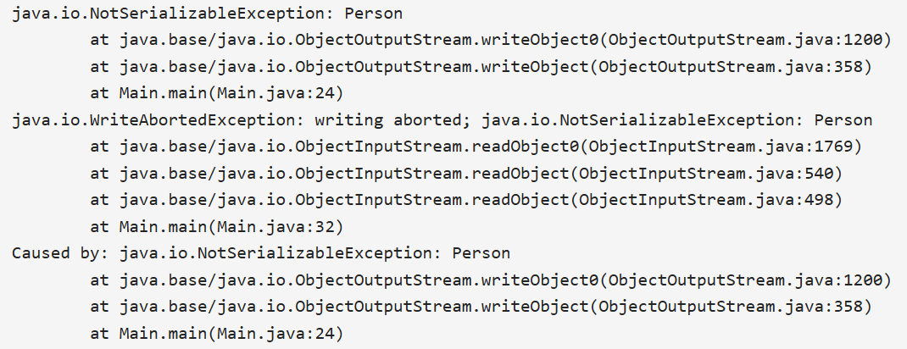
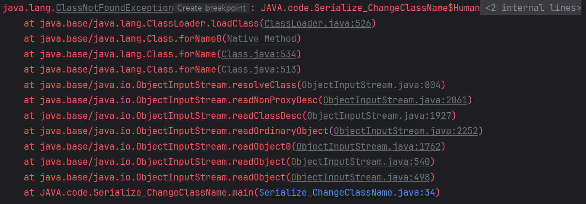
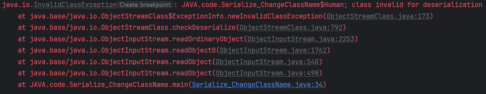

# 직렬화와 역직렬화
> 직렬화가 뭐더라?

직렬화(Serialize)는 **메모리 상의 데이터**를 **파일 형태**로 저장하기 위해, 또는 **통신 매체를 통해 전송**하기 위해
적절한 형태로 변환하는 과정입니다.

> 역직렬화는 그 반대의 의미인가요?

직렬화의 반대 의미가 맞습니다.
역직렬화(Deserialize)는 저장된 파일 또는 통신으로 받은 데이터를 메모리에서 사용하기 위한 형태로 변환하는 과정입니다.

# 왜 직렬화가 필요할까?
> 메모리 상의 데이터 형태 그대로 저장하거나 전송할 수 없어서 직렬화를 사용하는 건가요?

맞는 말입니다. 왜 메모리 데이터를 그대로 사용할 수 없을까요? 

파일로 저장하거나 통신을 할 때는 '값' 형태의 데이터만 사용 가능합니다.
이 점을 염두에 두고 메모리에 저장된 데이터를 살펴보도록 하겠습니다.
메모리에 저장된 데이터는 크게 두 영역으로 구분할 수 있습니다.
1. primitive type - 값 자체를 저장하고 있는 영역
2. reference type - 값이 저장된 주소를 저장하고 있는 영역

여기서 reference type 데이터는 그대로 저장하거나 전송할 수 없습니다.
reference type을 그대로 직렬화하여 파일로 저장하고 이후에 역직렬화하여 사용한다고 해도 
해당 주소에 직렬화하기 전의 값이 그대로 저장되어 있다고 보장할 수 없습니다.
또한 통신으로 전송하여 다른 장치에서 역직렬화 후 사용한다고 해도 
해당 주소에는 완전히 다른 값이 저장되어 있을 것이기 때문에 사용할 수 없습니다.

따라서 파일로 저장하거나 통신을 할 때는 값 형태의 데이터만 사용 가능하고,
메모리는 참조형 데이터도 포함하기 때문에 메모리 데이터를 그대로 사용할 수 없습니다.

그래서 직렬화를 통해 참조형 데이터를 값 데이터로 변환하는 작업이 필요합니다.
참조형 데이터를 직렬화 할 때는 각 주소값이 가지는 데이터를 모아서 값 형태로 변환합니다.
JSON, XML, CSV, Binary, Java 직렬화 등 다양한 형태로 변환 가능하지만,
변환 결과의 공통점은 **파싱 가능한 형태의 유의미한 데이터**를 만든다는 것입니다.

# Java의 직렬화와 역직렬화
자바의 직렬화는 자바 시스템 간에 데이터를 교환할 때 사용됩니다.
직렬화가 필요한 클래스의 경우 `Serializable` 인터페이스를 구현하면 됩니다.
해당 인터페이스를 구현해야 하는 이유는 자바 객체는 기본적으로 직렬화 기능이 비활성화 되어 있기 때문입니다.

자세한 Java 직렬화 방법은 [아래](#java-직렬화-역직렬화-구현하기)에서 살펴보도록 하겠습니다. 

**자바의 직렬화**는 JVM 메모리에 상주 중인 객체를 JVM 외부의 다른 시스템에서 사용할 수 있도록
객체 데이터를 바이트 형태로 변환하는 과정입니다.
**자바의 역직렬화**는 바이트 형태의 데이터를 객체로 변환하여 JVM에 상주시키는 과정입니다.

# Java 직렬화의 장점과 단점
> 직렬화 결과 JSON, XML 등의 형태로 다양하게 변환 가능하다고 했는데 Java 직렬화는 다른 형태로 변환할 수 없는 건가요?

JVM의 객체도 JSON, XML 등으로 변환 가능합니다. 상황에 맞는 방법을 사용하는 게 좋다고 생각합니다.
그런 의미에서 Java 직렬화의 장점과 단점을 살펴보겠습니다.

## 장점
Java 직렬화의 장점은 아래와 같습니다.
- 자바 시스템에 최적화 되어 있습니다.
- 직렬화와 역직렬화 조건만 충족하면 바로 직렬화와 역직렬화가 가능합니다.
    - 자세한 조건은 아래에서 코드를 통해 알아보겠습니다. 

장점의 이면에는 항상 단점이 존재하기 마련입니다. Java 직렬화의 단점을 알아보겠습니다.

## 단점
Java 직렬화의 단점은 아래와 같습니다.

- 직렬화를 한 후 아직 역직렬화를 하지 않은 상태에서 클래스 구조가 변경되면 역직렬화가 불가능하다.
    - 새로운 필드가 추가 되거나 필드의 타입이 변경되는 등 모든 구조 변경이 해당된다.
- 직렬화 결과가 용량을 많이 차지한다.
    - 저장 용량이 충분하지 않다면 JSON과 같은 형태로 직렬화하는 것이 좋다.

# Java 직렬화, 역직렬화 구현하기
실제로 Java 직렬화와 역직렬화를 구현해보며 직렬화와 역직렬화에 필요한 조건들을 살펴보겠습니다.

## 구현
```java
import java.io.*;

class Person implements Serializable { // 직렬화를 하기 위한 클래스
    private static final long serialVersionUID = 1L; // 직렬화 버전 관리
    private String name;
    private int age;

    public Person(String name, int age) {
        this.name = name;
        this.age = age;
    }

    public void displayInfo() {
        System.out.println("이름: " + name + ", 나이: " + age);
    }
}

public class SerializationExample {
    public static void main(String[] args) {
        Person person = new Person("홍길동", 30);

        // 직렬화하여 파일에 저장
        try (ObjectOutputStream oos = new ObjectOutputStream(new FileOutputStream("person.ser"))) {
            oos.writeObject(person);
            System.out.println("객체가 person.ser 파일에 저장됨.");
        } catch (IOException e) {
            e.printStackTrace();
        }

        // 역직렬화하여 객체 복원
        try (ObjectInputStream ois = new ObjectInputStream(new FileInputStream("person.ser"))) {
            Person deserializedPerson = (Person) ois.readObject();
            System.out.println("파일에서 객체를 읽어옴:");
            deserializedPerson.displayInfo();
        } catch (IOException | ClassNotFoundException e) {
            e.printStackTrace();
        }
    }
}

```


위 코드를 참고하여 자바 직렬화와 역직렬화의 조건을 살펴보겠습니다.

## 직렬화 조건
- `Seiralizable` 인터페이스를 구현해야 합니다. 
- 만약 구현하지 않았다면 아래와 같이 `NoSerializableException`이 발생합니다.

- `serialVersionUID`를 직접 관리하는 게 좋습니다. 
`serialVersionUID`를 명시하지 않으면 자바가 임의의 값으로 설정해 주지만
클래스 구조가 변경되면 새로운 값으로 갱신됩니다.
    - 여기서 `serialVersionUID`란 객체의 버전을 식별하는 역할을 합니다.
    앞서 자바 역직렬화의 단점 중에 클래스의 구조가 변경되면 역직렬화가 불가능하다고 말씀드렸습니다.
    하지만 `serialVersionUID`가 같고 클래스 타입이 같다면 클래스 구조가 바뀌어도 역직렬화가 가능합니다.
    - 자바가 `serialVersionUID`를 관리하면 클래스 구조가 바뀔 때마다 갱신되므로 역직렬화가 불가능해질 수 있습니다.
    따라서 `serialVersionUID`는 직접 관리하는 게 좋습니다.

## 역직렬화 조건
역직렬화의 조건은 다음과 같이 다양합니다.
- 직렬화된 객체에 저장된 클래스 이름과 실제 클래스 이름이 동일해야 합니다.
즉, 직렬화 후 클래스 이름이 변경되면 역직렬화가 불가능합니다.
클래스 이름이 변경되면 아래와 같은 오류가 발생합니다.

- 패키지명이 동일해야 합니다.
- `serialVersionUID`가 동일해야 합니다.
- 상속 구조가 동일해야 합니다.
- 클래스가 Serializable 인터페이스를 구현하고 있어야 합니다.
즉, 직렬화 후 Serializable 인터페이스 구현을 해제한다면 역직렬화가 불가능합니다.
직렬화 후 Serializable 인터페이스 구현을 해제하면 아래와 같은 오류가 발생합니다.

- private/public 등 접근 제한자가 달라져도 역직렬화는 가능하지만 예상치 못한 동작이 발생할 수 있습니다.

# Java 직렬화의 사용처
> 자바 직렬화는 언제 사용되나요?

자바 직렬화가 구체적으로 언제 사용되는지 알아보겠습니다.
자바 직렬화는 객체가 자바 애플리케이션 범위를 벗어난 영역에서 다루어져야 하는 경우에 주로 사용됩니다.
대표적인 예시는 아래와 같습니다.

- 분산 시스템(RMI(Remote Method Invocation, 원격 메서드 호출), Kafka)에서 객체를 주고 받을 때
- 데이터베이스에 객체를 저장할 때(보통 BLOB(Binary Large Object) 형태) 
- 네트워크를 통해 객체를 주고 받을 때(소켓 통신)
- 객체를 파일에 저장할 때(캐싱(Redis 등), 로그 저장)

그 이외에도 서블릿 세션에서 사용될 수도 있습니다. 서블릿 세션을 메모리에서 관리하는 경우엔
직렬화가 불필요하지만 파일 형태로 관리해야 한다면 직렬화가 필요합니다.
그래서 세션에 필요한 객체는 Serializable 인터페이스를 구현하는 게 좋습니다.

# Java 직렬화 사용 시 주의할 점
>자바 직렬화 사용 시 주의할 점이 있을까요?

자바 직렬화는 자바 시스템 환경에서 편하게 사용하기 위한 기술입니다.
그렇기 때문에 주의할 점도 있는데요, 이번엔 자바 직렬화를 사용할 때 주의할 점을 알아보겠습니다.
- 외부 저장소에 저장하는 경우 자바 직렬화 사용을 지양한다.
  - 자바 직렬화의 결과는 용량을 많이 차지하기 때문입니다.
  - 저장되는 형태가 바이너리 형태이기 때문에 사람이 읽을 수 없습니다.
  - 다른 언어와 호환되지 않습니다.
- 역직렬화 시 예외가 생길 수 있음을 인지하고 사용한다.
- 자주 변경되는 데이터에 대해선 자바 직렬화 사용을 지양한다.

Java 직렬화를 사용하기 어려운 상황이라면 JSON 등 다른 포맷을 고려해 보는 게 좋습니다.

# 참조
https://steady-coding.tistory.com/576
https://nesoy.github.io/blog/Java-Serialize
