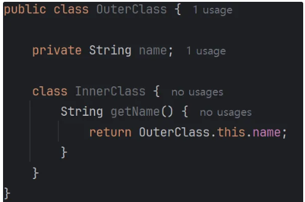
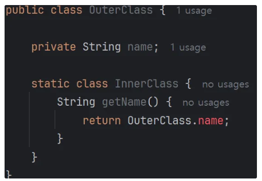
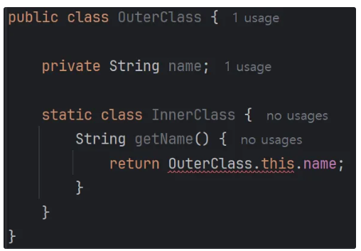
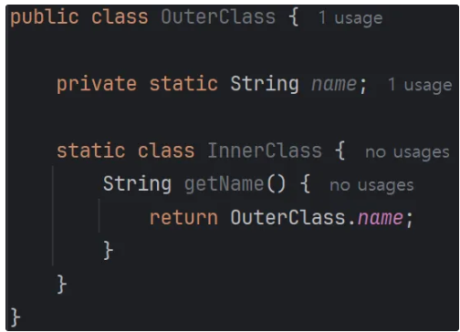
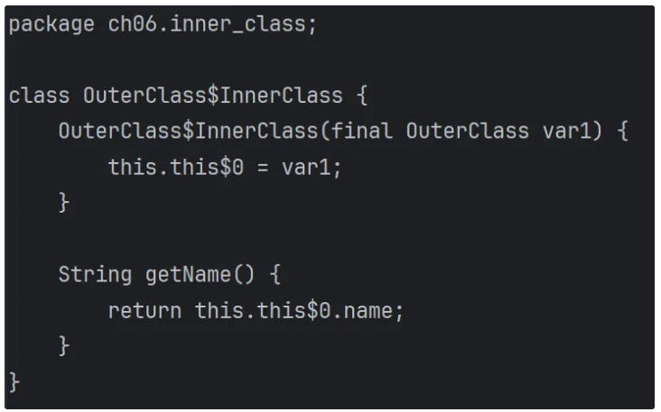

# Inner Class는 왜 정적(static)으로 선언하는 게 좋을까?
## non-static으로 선언하는 경우
우선 Inner Class를 non-static으로 선언하는 경우부터 알아보자.
Inner Class가 Outer Class의 자원을 사용해야 하는 경우 Inner Class는 non-static이어야 한다.
### Why?
다음 코드를 보면 InnerClass가 static으로 선언된 경우 OuterClass의 필드 변수에 접근할 수 없다.
다만 InnerClass가 static으로 선언되더라도 OuterClass의 static 변수에는 접근할 수 있다.

코드1

코드2

코드3

코드4

위 경우가 아니라면 static으로 선언하는 게 좋다. 왜일까?
## static으로 선언해야 하는 이유
이너 클래스를 비정적(non-static)으로 선언하게 되면 이너 클래스는 아우터 클래스에 대한 참조를 가지게 된다. 
위 코드1을 보면 InnerClass가 OuterClass의 this에 접근할 수 있는 걸 확인할 수 있는데, 그 이유가 바로 OuterClass에 대한 참조를 가지기 때문이다.

코드1을 컴파일하면 OuterClass$InnerClass.class라는 파일이 생성된다. 
확인해보면 다음과 같이 OuterClass를 매개변수로 받아서 인스턴스 변수로 저장하는 것을 볼 수 있다. 

그래서 InnerClass는 정규화된 this를 사용하여 OuterClass에 접근할 수 있다. 
정규화된 this란 클래스명.this 형태로 바깥 클래스 이름을 명시하는 방식이다.

그렇다면 외부 클래스에 대한 참조를 가지는게 왜 위험할까? 
JVM의 GC를 떠올리면 된다. GC는 런타임 중에 참조되지 않는 객체를 찾아 제거한다. 

만약 위와 같은 상황에서 외부 클래스가 더 이상 필요하지 않다면 외부 클래스는 GC의 대상이 될까?
그렇지 않다. 왜냐하면 내부 클래스가 항상 외부 클래스를 참조하고 있기 때문이다.
그래서 외부 클래스가 더 이상 사용되지 않더라도 GC 대상이 되지 않아서 프로그램이 종료될 때까지 메모리를 차지하게 된다.
일종의 메모리 누수 현상이 발생하게 되는 것이다.
이러한 외부 클래스 객체가 많이 생성된다면 머지않아 메모리 초과로 인해 프로그램이 비정상적으로 종료될 것이다.

그렇기 때문에 내부 클래스가 외부 클래스의 필드 변수를 참조하지 않는 이상 내부 클래스는 정적으로 선언하는 게 좋다.
개인적으로 느끼기에는 내부 클래스가 외부 클래스를 참조하는 형태도 지양해야 한다고 생각한다.
왜냐하면 이런 경우를 용인하다 보면 다른 해결책을 고려하지 않게 될 것이고 결국 메모리 문제가 발생할 게 뻔하기 때문이다.
