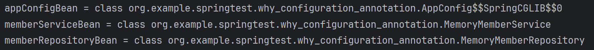

어노테이션 기반으로 빈을 설정할 때 설정 클래스에 `@Configuration` 어노테이션을 붙이면 스프링은 싱글톤으로 빈을 등록한다.
아래와 같은 설정 파일에서는 `@Configuration` 어노테이션을 사용하지 않으면 스프링은 빈을 싱글톤이 아니라 여러 객체로 등록한다.

```java
public class AppConfig {

    @Bean
    public MemberService memberService() {
        return new MemoryMemberService(meberRepository);
    }
    
    @Bean
    public MemberRepository memberRepository() {
        return new MemoryMemberRepository();
    }
}
```

`@Configuration` 어노테이션이 붙어있으면 스프링은 이미 등록된 빈을 다시 등록하는 경우 이미 등록된 빈을 리턴하는 방식으로 싱글톤을 유지한다.
그럴 수 있는 이유는 바이트 코드를 조작하는 CGLIB 기술 덕분인데, ApplicationContext에 전달하는 설정 파일의 코드를 스프링이 조작하여 아예 다른 클래스를 설정파일로 등록한다.
아래 `AppConfig` 클래스를 설정 파일로 등록하는 예시를 보자.
자세한 코든느 [여기서](../SpringTest/src/main/java/org/example/springtest/why_configuration_annotation) 직접 테스트할 수 있다.

```java
@Configuration
public class AppConfig {

    @Bean
    public MemberService memberService() {
        return new MemoryMemberService(meberRepository);
    }
    
    @Bean
    public MemberRepository memberRepository() {
        return new MemoryMemberRepository();
    }
}
```

```java
package org.example.springtest.why_configuration_annotation;

import org.springframework.context.ApplicationContext;
import org.springframework.context.annotation.AnnotationConfigApplicationContext;

public class AppConfigClassNameTest {

    static ApplicationContext ac = new AnnotationConfigApplicationContext(AppConfig.class);

    public static void main(String[] args) {
        AppConfig appConfigBean = ac.getBean(AppConfig.class);
        MemberService memberServiceBean = ac.getBean(MemberService.class);
        MemberRepository memberRepositoryBean = ac.getBean(MemberRepository.class);

        System.out.println("appConfigBean = " + appConfigBean.getClass());
        System.out.println("memberServiceBean = " + memberServiceBean.getClass());
        System.out.println("memberRepositoryBean = " + memberRepositoryBean.getClass());
    }
}

```

`appConfigBean`의 클래스 출력 결과를 확인해보면 다음과 같이 내가 생성한 `AppConfig` 클래스가 아니라 다른 이름의 클래스가 출력되는 것을 알 수 있다.


`AppConfig$$SpringCGLIB$$0`은 스프링의 CGLIB가 `AppConfig` 클래스를 상속 받아서 새로 만든 클래스임을 의미한다.
새로 만들어진 클래스에서는 다음 수도 코드와 같이 빈이 존재하면 해당 빈을 반환하는 방식으로 동작한다.

```java
@Bean
public MemberRepository memberRepository() {
//    if (해당 빈이 존재할 경우) {
//       return 스프링 컨테이너에서 빈을 찾은 후 반환 
//    } else {
//        스프링 컨테이너에 빈을 등록
//        return 등록한 빈을 그대로 반환
//    }
}
```

스프링은 빈 객체를 싱글톤으로 관리하며, 그렇게 하기 위해선 설정 클래스에 `@Configuration` 어노테이션을 꼭 붙여야 한다.
필요에 따라 싱글톤으로 관리하지 않는 객체가 필요하다면 해당 설정 클래스에는 `@Configuration` 어노테이션을 붙이지 않아도 된다.
하지만 그런 경우는 극히 드물다.