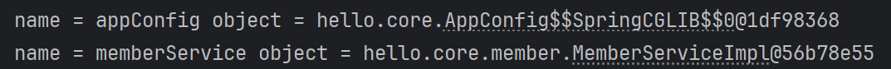

다음과 같이 자바의 `Configuration` 어노테이션을 사용한 클래스를 `AnnotationConfigApplicationContext`의 생성자로 전달하는 것으로 어노테이션 기반으로 스프링 컨테이너를 구성할 수 있다.

```java
package hello.core;

import hello.core.member.MemberRepository;
import hello.core.member.MemberService;
import hello.core.member.MemberServiceImpl;
import hello.core.member.MemoryMemberRepository;
import org.springframework.context.annotation.Bean;
import org.springframework.context.annotation.Configuration;

@Configuration
public class AppConfig {

    @Bean
    public MemberService memberService() {
        return new MemberServiceImpl(memberRepository());
    }

    @Bean
    public MemberRepository memberRepository() {
        return new MemoryMemberRepository();
    }
}

```

다음은 실제로 스프링 컨테이너를 구성하고 등록된 빈의 목록을 확인하는 테스트 코드다
```java
package hello.core;

import org.junit.jupiter.api.DisplayName;
import org.junit.jupiter.api.Test;
import org.springframework.beans.factory.config.BeanDefinition;
import org.springframework.context.annotation.AnnotationConfigApplicationContext;

public class ApplicationContextInfoTest {

    AnnotationConfigApplicationContext ac = new AnnotationConfigApplicationContext(AppConfig.class);

    @Test
    @DisplayName("애프리케이션 빈 출력하기")
    void findApplicationBean() {
        String[] beanDefinitionNames = ac.getBeanDefinitionNames();

        for (String beanDefinitionName : beanDefinitionNames) {
            BeanDefinition beanDefinition = ac.getBeanDefinition(beanDefinitionName);
            if (beanDefinition.getRole() == BeanDefinition.ROLE_APPLICATION) {
                Object bean = ac.getBean(beanDefinitionName);
                System.out.println("name = " + beanDefinitionName + " object = " + bean);
            }
        }
    }
}

```

if문의 조건으로 `ROLE_APPLICATION`을 사용했는데 이 의미는 스프링 프레임워크가 스스로 등록하는 빈이 아니라 처음 코드처럼 개발자가 직접 등록한 빈만 출력한다는 것이다.
만약 스프링 프레임워크가 등록한 빈도 출력하고 싶다면 `ROLE_INFRASTRUCTURE` 값을 사용하면 된다.

### 궁금증
처음 `AppConfig` 코드에서 memberRepository를 빈으로 등록하지 않으면 오류가 발생할까?
```java
package hello.core;

import hello.core.member.MemberRepository;
import hello.core.member.MemberService;
import hello.core.member.MemberServiceImpl;
import hello.core.member.MemoryMemberRepository;
import org.springframework.context.annotation.Bean;
import org.springframework.context.annotation.Configuration;

@Configuration
public class AppConfig {

    @Bean
    public MemberService memberService() {
        return new MemberServiceImpl(memberRepository());
    }

//    @Bean
    public MemberRepository memberRepository() {
        return new MemoryMemberRepository();
    }
}

```

빈으로 등록되지 않은 메서드를 호출하는 것이라 오류가 발생할 것이라 생각했지만 놀랍게도 오류가 발생하지 않고 정상 실행됐다.
그리고 아래와 같이 memberRepository를 제외한 빈이 등록된 것을 확인할 수 있었다.



이유가 뭘까?

찾아보니 GCLIB라는 프록시 기술이 나오는데 이게 확실한 이유인지 모르겠을 뿐더러 내용이 너무 깊어서 따로 다뤄봐야 할 문제인 것 같다.