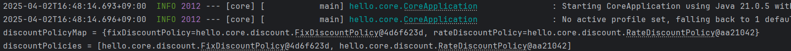

###### 인프런 김영한 강사님의 '스프링 핵심 원리 - 기본편'을 기반으로 작성한 글입니다.

`@Autowired`로 의존관계 자동 주입을 사용할 때 하나의 빈이 아니라 같은 타입의 모든 빈을 주입받을 수 있다.
아래 코드처럼 생성자 주입으로 여러 빈을 받을 수 있다.
```java
@Getter
@Component
public class TestClass {

    private final Map<String, DiscountPolicy> discountPolicyMap;
    private final List<DiscountPolicy> discountPolicies;

    @Autowired
    public TestClass(Map<String, DiscountPolicy> discountPolicyMap
            , List<DiscountPolicy> discountPolicies) {
        this.discountPolicyMap = discountPolicyMap;
        this.discountPolicies = discountPolicies;
        System.out.println("discountPolicyMap = " + discountPolicyMap);
        System.out.println("discountPolicies = " + discountPolicies);
    }
}
```
받은 빈을 출력한 모습이다.<br>


이 방법을 활용하면 전략 패턴을 다음과 같이 쉽게 구현할 수 있다.
```java
@Getter
@Component
public class TestClass {

    private final Map<String, DiscountPolicy> discountPolicyMap;
    private final List<DiscountPolicy> discountPolicies;

    @Autowired
    public TestClass(Map<String, DiscountPolicy> discountPolicyMap
            , List<DiscountPolicy> discountPolicies) {
        this.discountPolicyMap = discountPolicyMap;
        this.discountPolicies = discountPolicies;
        System.out.println("discountPolicyMap = " + discountPolicyMap);
        System.out.println("discountPolicies = " + discountPolicies);
    }
    
    public int discount(int price, int quantity, String strategy) {
        DiscountPolicy discountPolicy = discountPolicyMap.get(strategy);
        return discountPolicy.discount(price, quantity);
    }
}
```