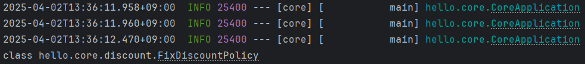

###### 인프런 김영한 강사님의 '스프링 핵심 원리 - 기본편'을 기반으로 작성한 글입니다.

`@AutoWired`로 의존 관계를 주입할 때 여러 빈이 조회되면 어떻게 처리해야 할까?

`@AutoWired`는 기본적으로 '타입'으로 빈을 조회한다.
예를 들어 아래와 같이 사용할 경우 `getBean(DiscountPolicy.class)`로 빈을 조회하는 것과 유사하다.
```java
@Autowired
private final DiscoutPolicy discoutPolicy;
```

저렇게 빈을 조회하면 `DiscountPolicy`의 자식 클래스들이 모두 조회된다.
그렇기 때문에 DiscountPolicy의 여러 자식 클래스들이 빈으로 등록되어 있다면 빈 조회 시 빈 `NoUniqueBeanDefinitionException` 오류가 발생할 수 있다.

주입할 빈을 하나로 특정해야 하는데 그 방법은 총 세가지가 있다.

## @Autowired의 필드명 매칭 기능 사용
`@AutoWired`는 처음에 타입으로 빈을 매칭하고, 여러 빈이 조회되면 그 안에서 필드명이나 매개변수 명으로 다시 매칭한다.

아래 예시를 보면, `FixDiscountPolicy`와 `RateDiscountPolicy`는 모두 `DiscountPolicy`를 구현한다.
이 상태에서 `DiscountPolicy` 타입을 주입받으려고 하면 컴파일 오류가 발생한다.

```java
@Component
public class FixDiscountPolicy implements DiscountPolicy{

    private int discountFixAmount = 1000;

    @Override
    public int discount(Member member, int price) {
        if (member.getGrade() == Grade.VIP) {
            return discountFixAmount;
        }
        return 0;
    }
}
```

```java
@Component
public class RateDiscountPolicy implements DiscountPolicy {

    @Override
    public int discount(Member member, int price) {
        return 0;
    }
}
```

컴파일 오류 발생


마우스를 올려보면 아래와 같은 메시지가 뜬다. `DiscountPolicy`타입으로 두 개 이상의 빈이 등록되어 있다는 문구이다.


이를 방지하기 위해서 필드 변수 이름을 `rateDiscountPolicy`나 `fixDiscountPolicy`로 바꾸면 @Autowired는 자동으로 변수명에 맞는 빈을 찾아서 주입한다.
이때 변수명은 주입 받고자 하는 클래스 이름의 맨앞 문자만 소문자로 하면 된다.

변수명을 `rateDiscountPolicy`로 바꾸니 오류가 발생하지 않는 모습을 확인할 수 있다.


## @Qualifier 사용
`@Qualifier` 어노테이션은 빈의 추가 구분자를 부여한다. 빈의 이름을 바꾸진 않는다.
아래와 같이 `FixDiscountPolicy`에 mainDiscountPolicy라는 구분자를 부여하는 방식이다.
```java
@Component
@Qualifier("mainDiscountPolicy")
public class FixDiscountPolicy implements DiscountPolicy{

    private int discountFixAmount = 1000;

    @Override
    public int discount(Member member, int price) {
        if (member.getGrade() == Grade.VIP) {
            return discountFixAmount;
        }
        return 0;
    }
}
```
```java
@Component
@Qualifier("rateDiscountPolicy")
public class RateDiscountPolicy implements DiscountPolicy {

    @Override
    public int discount(Member member, int price) {
        return 0;
    }
}
```

빈을 주입 받을 때 구분자로 구분하려면 아래와 같이 작성하면 된다.

필드 변수 주입


생성자 주입


setter 주입


만약 해당하는 구분자가 부여된 빈이 없다면 구분자를 이름으로 가지는 빈을 주입한다.
예를 들어 `@Qualifier("mainDiscountPolicy")`가 부여된 빈이 없다면 이름이 `mainDiscountPolicy` 빈을 주입한다.
하지만 이런 자세한 기능은 언젠가 헷갈리기 마련이기 때문에 `@Qualifier`는 구분자 용도로만 사용하고
빈의 이름까지는 고려하지 않는 게 좋을 것 같다.

참고로 구분자 이름이 틀려도 컴파일 오류가 발생하지 않는다. 구분자 이름을 잘못 작성해서 다른 빈이 주입되는 상황을 주의하자.

## @Primary 사용
`@Primary`는 우선권을 부여한다. 같은 타입의 빈이 여러개 등록된 경우 `@Primary`가 붙은 클래스를 우선적으로 고른다는 뜻이다.
아래와 같이 두 클래스가 있으면 `FixDiscountPolicy`가 우선적으로 선택된다.
```java
@Component
@Primary
public class FixDiscountPolicy implements DiscountPolicy{

    private int discountFixAmount = 1000;

    @Override
    public int discount(Member member, int price) {
        if (member.getGrade() == Grade.VIP) {
            return discountFixAmount;
        }
        return 0;
    }
}
```
```java
@Component
public class RateDiscountPolicy implements DiscountPolicy {

    @Override
    public int discount(Member member, int price) {
        return 0;
    }
}
```

우선권이 부여되지 않은 `RateDiscountPolicy`를 주입받으려면 어떻게 해야 할까?
이를 알아보기 위해 `@Autowired`로 주입되는 우선순위를 알아보자.

## 우선순위
스프링은 보통 더 좁은 범위로 사용되는 것의 우선순위를 높인다. 예를 들어 `@Primary`보다 `@Qualifier`가 우선순위가 높다.
실제로 그런지 알아보자.

아래와 같이 `FixDiscountPolicy`는 `@Primary`, `RateDiscountPolicy`는 `@Qualfier`를 부여했다.
```java
@Component
@Primary
public class FixDiscountPolicy implements DiscountPolicy {

}
```
```java
@Component
@Qualifier("rateDiscountPolicy")
public class RateDiscountPolicy implements DiscountPolicy {
    
}
```
그리고 `TestClass`의 필드변수 명을 아래와 같이 두고 스프링 서버를 실행하면 주입된 클래스 타입은 `@Primary`가 적용됐던 `FixDiscountPolicy`임을 확인할 수 있다.
```java
@Getter
@Component
public class TestClass {

    @Autowired
    private DiscountPolicy discountPolicy;
}
```
```java
@SpringBootApplication
public class CoreApplication {

	public static void main(String[] args) {
		ConfigurableApplicationContext ac = SpringApplication.run(CoreApplication.class, args);
		TestClass bean = ac.getBean(TestClass.class);
		System.out.println(bean.getDiscountPolicy().getClass());
	}
}
```
실행 결과


이 코드에서 `TestClass`에 `@Qualifier`를 적용하면 아래과 같이 `@RateDiscountPolicy` 타입이 주입되는 걸 확인할 수 있다.
```java
@Getter
@Component
public class TestClass {

    @Autowired
    private @Qualifier("rateDiscountPolicy") DiscountPolicy discountPolicy;
}
```

즉, `@Primary`보다 `@Qualifier`의 우선순위가 더 높은 것이다.

그러면 이제 `@Qualifier`와 `@Autowired`의 필드명을 설정하는 것 중 어느 것이 우선순위가 더 높은지 확인해보자.
다음과 같이 `TestClass`의 필드 변수명을 `fixDiscountPolicy`로 두어도 `@Qualifier`가 우선권을 가지는 걸 확인할 수 있다. 
```java
@Getter
@Component
public class TestClass {

    @Autowired
    private @Qualifier("rateDiscountPolicy") DiscountPolicy fixDiscountPolicy;
}
```


그렇다면 마지막으로 `@Primary`와 비교해보자. 개인적인 생각으론 필드명을 바꾸는 게 우선권을 가질 것 같다.
`TestClass`를 아래와 같이 수정했다. `@Primary`는 `FixDiscountPolicy`에 적용되고 있는 상태다.
```java
@Getter
@Component
public class TestClass {

    @Autowired
    private DiscountPolicy rateDiscountPolicy;
}
```

실행 결과를 출력해보면... 예상과는 반대로 `FixDiscountPolicy`가 주입된 걸 확인할 수 있었다.


결과적으로 `@Autowired`의 필드명을 설정하는 방법 -> `@Primary` 사용 -> `@Qualifier` 사용 순으로 우선순위가 높은 걸 알 수 있었다.
필드명을 설정하는 방식은 할 때마다 클래스 이름을 확인해야 한다는 단점도 있고, 잘못 작성해도 컴파일러가 오류로 잡아주지만 그래도 헷갈리기 쉬울 것 같다.
그래서 그런지 보통은 `@Primary`와 `@Qualifier`를 혼용하는 방법을 많이 사용한다고 한다.